# 🎓 Plataforma Educacional Distribuída

Uma plataforma educacional moderna baseada em arquitetura de **microserviços**, desenvolvida com **.NET 9**, **Angular 18**, **RabbitMQ**, **SQL Server** e **Redis**, totalmente containerizada com **Docker**.


### Integrantes
- Hugo Domynique
- Jairo Azevedo
- Jason Santos do Amaral
- Karina Esparza
- Marco Aurelio Roque

## 📋 Índice

- [Arquitetura do Sistema](#️-arquitetura-do-sistema)
- [Pré-requisitos](#-pré-requisitos)
- [Execução Rápida](#-execução-rápida)
- [Microserviços](#-microserviços)
- [Infraestrutura](#%EF%B8%8F-infraestrutura)
- [URLs de Acesso](#-urls-de-acesso)
- [Desenvolvimento](#%EF%B8%8F-desenvolvimento)
- [Testes](#-testes)
- [Building Blocks](#-building-blocks)
- [Script](#-scripts)
- [Usuários de Exemplo](#-usuários-de-exemplo)
- [Monitoramento](#-monitoramento)
- [Solução de Problemas](#-solução-de-problemas)
- [Segurança](#-segurança)
- [Estrutura do Projeto](#estrutura-do-projeto)
- [Licença](#-licença)

## 🏗️ Arquitetura do Sistema

### Visão Geral

A plataforma é composta por **5 microserviços independentes** + **1 BFF** + **1 Frontend**, cada um com seu próprio banco de dados e responsabilidades específicas:

```mermaid
---
config:
  layout: fixed
---
flowchart TD
 subgraph Front["🖥️ Front"]
    direction LR
        Frontend["🌐 Angular 18 SPA<br>📍 Porta: 4200"]
  end
 subgraph BFF_Layer["🔗 BFF"]
    direction LR
        BFF["🔗 BFF API<br>📍 Porta: 5000<br>🏗️ Gateway"]
  end
 subgraph Microservicos["🚀 Microserviços"]
    direction LR
        Auth["🔐 Auth API<br>📍 5001<br>🔑 Autenticação"]
        Conteudo["📚 Conteudo API<br>📍 5002<br>📖 Cursos &amp; Aulas"]
        Alunos["🎓 Alunos API<br>📍 5003<br>👨‍🎓 Matrículas"]
        Pagamentos["💳 Pagamentos API<br>📍 5004<br>💰 Transações"]
  end
 subgraph Infra["🏗️ Infra — Dados & Cache"]
    direction LR
        AuthDB["🗄️ Auth DB<br>📍 SQL Server"]
        ConteudoDB["🗄️ Conteudo DB<br>📍 SQL Server"]
        AlunosDB["🗄️ Alunos DB<br>📍 SQL Server"]
        PagamentosDB["🗄️ Pagamentos DB<br>📍 SQL Server"]
        Cache["🔴 Redis<br>📍 6379<br>⚡ Cache"]
  end
 subgraph Mensageria["📬 Mensageria"]
    direction TB
        Rabbit["🐰 RabbitMQ"]
  end
    Frontend -- 1 --> BFF
    BFF -- 2 --> Auth
    BFF -- 3 --> Conteudo
    BFF -- 4 --> Alunos
    BFF -- 5 --> Pagamentos
    Auth -- 6 --> AuthDB
    Conteudo -- 7 --> ConteudoDB
    Alunos -- 8 --> AlunosDB
    Pagamentos -- 9 --> PagamentosDB
    BFF -- 10 --> Cache
    Auth -- 11 --> Rabbit
    Alunos -- 12 --> Rabbit
    Pagamentos -- 13 --> Rabbit
    MensageriaStart[[" "]]
     Frontend:::frontend
     BFF:::bff
     Auth:::microservice
     Conteudo:::microservice
     Alunos:::microservice
     Pagamentos:::microservice
     AuthDB:::infrastructure
     ConteudoDB:::infrastructure
     AlunosDB:::infrastructure
     PagamentosDB:::infrastructure
     Cache:::infrastructure
     Rabbit:::messaging
     MensageriaStart:::invisible
    classDef frontGroup fill:#e3f2fd,stroke:#1976d2,stroke-width:3px
    classDef bffGroup fill:#f3e5f5,stroke:#7b1fa2,stroke-width:3px
    classDef microGroup fill:#e8f5e8,stroke:#388e3c,stroke-width:3px
    classDef infraGroup fill:#fff3e0,stroke:#f57c00,stroke-width:3px
    classDef msgGroup fill:#f1f8e9,stroke:#689f38,stroke-width:3px
    classDef invisible fill:none,stroke:none
    classDef frontend fill:#bbdefb,stroke:#1976d2,stroke-width:2px,color:#000
    classDef bff fill:#e1bee7,stroke:#7b1fa2,stroke-width:2px,color:#000
    classDef microservice fill:#c8e6c9,stroke:#388e3c,stroke-width:2px,color:#000
    classDef infrastructure fill:#ffe0b2,stroke:#f57c00,stroke-width:2px,color:#000
    classDef messaging fill:#dcedc8,stroke:#689f38,stroke-width:2px,color:#000
    linkStyle 0 stroke:#1e88e5,stroke-width:3px,fill:none
    linkStyle 1 stroke:#8e24aa,stroke-width:3px,fill:none
    linkStyle 2 stroke:#43a047,stroke-width:3px,fill:none
    linkStyle 3 stroke:#fdd835,stroke-width:3px,fill:none
    linkStyle 4 stroke:#fb8c00,stroke-width:3px,fill:none
    linkStyle 5 stroke:#d81b60,stroke-width:3px,fill:none
    linkStyle 6 stroke:#5e35b1,stroke-width:3px,fill:none
    linkStyle 7 stroke:#00acc1,stroke-width:3px,fill:none
    linkStyle 8 stroke:#c0ca33,stroke-width:3px,fill:none
    linkStyle 9 stroke:#f4511e,stroke-width:3px,fill:none
    linkStyle 10 stroke:#3949ab,stroke-width:3px,fill:none
    linkStyle 11 stroke:#6d4c41,stroke-width:3px,fill:none
    linkStyle 12 stroke:#00796b,stroke-width:3px,fill:none

```



### Princípios Arquiteturais

- ✅ **Database per Service**: Cada microserviço tem seu próprio banco
- ✅ **Event-Driven Architecture**: Comunicação assíncrona via RabbitMQ
- ✅ **API Gateway Pattern**: BFF centraliza comunicação com frontend
- ✅ **Circuit Breaker**: Resiliência com Polly
- ✅ **Health Checks**: Monitoramento de saúde dos serviços
- ✅ **JWT Authentication**: Autenticação centralizada
- ✅ **Clean Architecture**: DDD, SOLID, CQRS

### Estrutura Clean Architecture por Microserviço

Cada microserviço segue a **Clean Architecture** com as seguintes camadas:

#### 📁 **API Layer** (Controllers, Middleware)
- Controllers REST
- Middleware de autenticação
- Configuração de Swagger
- Validação de entrada

#### 📁 **Application Layer** (Use Cases, Services)
- DTOs de entrada/saída
- Interfaces de serviços
- Handlers de comandos/queries (CQRS)
- Validação de negócio

#### 📁 **Domain Layer** (Entities, Value Objects)
- Entidades de domínio
- Value Objects
- Interfaces de repositórios
- Eventos de domínio
- Regras de negócio

#### 📁 **Infrastructure Layer** (Data, External Services)
- Implementação de repositórios
- Contexto do Entity Framework
- Integração com RabbitMQ
- Configurações de banco de dados

## 🤔 Por que Scripts Auxiliares?

### ✅ **Scripts PowerShell**
- ✅ Ordem correta de inicialização 
- ✅ Verificações de saúde dos Serviços
- ✅ Mensagens informativas
- ✅ Tratamento de erros

### 📋 **Opções Disponíveis**
1. **PowerShell (.ps1)** - Automação completa
2. **Docker Compose puro**

## 🚀 Pré-requisitos

### Obrigatórios
- **Docker** >= 20.10
- **Docker Compose** >= 2.0
- **Git**

### Para Desenvolvimento
- **.NET SDK 9.0**
- **Node.js 18+** (para Angular)
- **Visual Studio 2022** ou **VS Code**

### Verificação da Instalação
```bash
# Verificar Docker
docker --version
docker-compose --version

# Verificar Git
git --version

# (Opcional) Verificar .NET
dotnet --version

# (Opcional) Verificar Node.js
node --version
npm --version
```

## ⚡ Execução Rápida

### 1. Clonar o Repositório
```bash
git clone https://github.com/jasonamaral/mba.modulo4.git
cd mba.modulo4
```

### 2. Executar o Sistema Completo

**PowerShell (Windows - Recomendado):**
```powershell
# Script completo com configuração automática do RabbitMQ
# Pode ser executado da raiz ou da pasta scripts
.\scripts\start-all.ps1
📋 O que o Script faz:
🛑 Para todos os containers
�� Limpa arquivos SQLite
🗑️ Remove TODAS as imagens antigas (exceto Redis/RabbitMQ)
🔍 Verifica limpeza completa
🏗️ Recria imagens dos microserviços
🚀 Inicia na ordem correta

# Ou se estiver na pasta scripts:
cd scripts
.\start-all.ps1
```

**Manual (Docker Compose apenas):**
```powershell
# Iniciar infraestrutura
docker-compose up -d rabbitmq redis

# Aguardar inicialização (aguarde ~2 minutos)
Start-Sleep -Seconds 120

# Iniciar microserviços
docker compose up -d auth-api conteudo-api alunos-api pagamentos-api

# Aguardar APIs (aguarde ~1 minuto)
Start-Sleep -Seconds 60

# Iniciar BFF e Frontend
docker-compose up -d bff-api frontend

# ⚠️ IMPORTANTE: Configurar filas RabbitMQ manualmente em http://localhost:15672
```

### 3. Acessar a Aplicação

Após ~5 minutos de inicialização:

- **🌐 Frontend**: http://localhost:4200 (aluno1@auth.api/Teste@123 ou admin@auth.api/Teste@123)
- **📊 RabbitMQ Management**: http://localhost:15672 (admin/admin123)

## 🔧 Microserviços

### Auth API (porta 5001)
**Responsabilidade**: Autenticação e autorização
- ✅ Cadastro e login de usuários
- ✅ Emissão e validação de tokens JWT
- ✅ Gerenciamento de roles (Admin/Aluno)
- ✅ Refresh tokens
- 📁 **Estrutura**: API → Application → Domain → Infrastructure
- 📊 **Swagger**: https://localhost:5001/swagger

### Conteudo API (porta 5002)
**Responsabilidade**: Gestão de conteúdo educacional
- ✅ CRUD de cursos
- ✅ CRUD de aulas
- ✅ Gerenciamento de materiais didáticos
- ✅ Estrutura curricular
- 📁 **Estrutura**: API → Application → Domain → Infrastructure
- 📊 **Swagger**: https://localhost:5002/swagger

### Alunos API (porta 5003)
**Responsabilidade**: Jornada do aluno
- ✅ Sistema de matrículas
- ✅ Tracking de progresso
- ✅ Geração de certificados
- ✅ Histórico acadêmico
- ✅ Consumo de eventos de pagamento
- 📁 **Estrutura**: API → Application → Domain → Infrastructure
- 📊 **Swagger**: https://localhost:5003/swagger

### Pagamentos API (porta 5004)
**Responsabilidade**: Processamento financeiro
- ✅ Processamento de pagamentos
- ✅ Consulta de status
- ✅ Emissão de eventos
- ✅ Histórico de transações
- 🔄 Camada Anti-Corrupção (Pagamentos API)
     Responsável por isolar integrações externas (gateways de pagamento) do domínio principal.
     Evita que dependências externas contaminem as regras de negócio.
     Implementada em src/backend/pagamentos-api/Pagamentos.AntiCorruption.
- 📁 **Estrutura**: API → Application → Domain → Infrastructure
- 📊 **Swagger**: https://localhost:5004/swagger

### BFF API (porta 5000)
**Responsabilidade**: Backend for Frontend
- ✅ Orquestração de chamadas
- ✅ Agregação de dados
- ✅ Cache distribuído (Redis)
- ✅ Rate limiting
- ✅ Circuit breaker
- 📁 **Estrutura**: API → Application → Domain → Infrastructure
- 📊 **Swagger**: http://localhost:5000/swagger

## 🏗️ Infraestrutura

### RabbitMQ
- **Management UI**: http://localhost:15672
- **Credenciais**: admin/admin123

### Redis
- **Host**: localhost:6379
- **Uso**: Cache distribuído para BFF

## 🌐 URLs de Acesso

### Aplicação
| Serviço | URL | Descrição |
|---------|-----|-----------|
| 📱 **Frontend** | http://localhost:4200 | Interface do usuário |
| 🔗 **BFF API** | http://localhost:5000 | Gateway para frontend |

### APIs (Swagger)
| API | HTTP | Descrição |
|-----|-------|------|-----------|
| 🔐 **Auth** | http://localhost:5001 | Autenticação |
| 📚 **Conteudo** | http://localhost:5002 | Cursos e aulas |
| 🎓 **Alunos** | http://localhost:5003 Matrículas |
| 💳 **Pagamentos** | http://localhost:5004 | Transações |

### Infraestrutura
| Serviço | URL | Credenciais |
|---------|-----|-------------|
| 🐰 **RabbitMQ** | http://localhost:15672 | admin/admin123 |
| 🔴 **Redis** | localhost:6379 | (sem senha) |

## 🛠️ Desenvolvimento

### Executar APIs Localmente
```powershell
# Auth API
cd src\backend\auth-api
dotnet run

# Conteudo API
cd src\backend\conteudo-api
dotnet run

# Alunos API
cd src\backend\alunos-api
dotnet run

# Pagamentos API
cd src\backend\pagamentos-api
dotnet run

# BFF API
cd src\backend\bff-api
dotnet run
```

### Executar Frontend Localmente
```powershell
cd src\frontend
npm install
npm start
```

### Rebuild de um Serviço
```bash
# Rebuild específico
docker-compose build [service-name]
docker-compose up -d [service-name]

# Exemplo: rebuild do Auth API
docker-compose build auth-api
docker-compose up -d auth-api
```

## 🧪 Testes
Cada microserviço possui testes automatizados:

- **UnitTests** → Validação de regras de negócio isoladas.  
- **IntegrationTests** → Testam endpoints reais com banco de dados em memória ou SQL local.

### Executando os testes
```bash
# Testes unitários
dotnet test src/backend/auth-api/tests/Auth.UnitTests
dotnet test src/backend/pagamentos-api/tests/Pagamentos.UnitTests

# Testes de integração
dotnet test src/backend/alunos-api/tests/Alunos.IntegrationTests
```

> Framework utilizado: **xUnit**  
> Cobertura recomendada: **80%+** (utilizando **Coverlet + ReportGenerator**)

## 📊 Cobertura de Testes


## 🧩 Building Blocks
A pasta `building-blocks/` contém componentes reutilizáveis entre microserviços:

- **Core** (`Core.csproj`)  
  - Communication (mensagens entre serviços)  
  - DomainObjects (objetos base de domínio)  
  - DomainValidations (validações reutilizáveis)  
  - Exceptions (exceções customizadas)  
  - Mediator (implementação do padrão Mediator)  
  - Notification (notificações de domínio)  
  - SharedDtos (DTOs comuns)  
  - Utils (funções auxiliares)  

- **MessageBus** (`MessageBus.csproj`)  
  - Implementação de **comunicação assíncrona** via RabbitMQ  
  - Base para publicação e consumo de eventos entre microserviços
  

## 📜 Scripts
Na pasta `scripts/` existem automações úteis:

- `start-all.ps1` → Inicializa toda a plataforma (infra + serviços)  
- `stop-all.ps1` → Para todos os containers  
- `setup-rabbitmq.sh` → Configura filas e exchanges no RabbitMQ  
- `rebuild-service.ps1` → Rebuild de um serviço específico  
- `clean.ps1` → Remove containers, imagens e volumes antigos  

## 👤 Usuários de Exemplo
A aplicação já possui usuários pré-configurados para testes:

| Usuário | Senha | Perfil |
|---------|-------|--------|
| `admin@auth.api` | `Teste@123` | Administrador |
| `aluno1@auth.api` | `Teste@123` | Aluno |


## 📊 Monitoramento

### Logs dos Serviços
```bash
# Ver todos os logs
docker-compose logs -f

# Ver logs de um serviço específico
docker-compose logs -f auth-api
docker-compose logs -f frontend
docker-compose logs -f rabbitmq
```

### Health Checks
Todos os serviços possuem endpoints de health check:
- Auth API: http://localhost:5001/health
- Conteudo API: http://localhost:5002/health
- Alunos API: http://localhost:5003/health
- Pagamentos API: http://localhost:5004/health
- BFF API: http://localhost:5000/health

### Monitorar Recursos
```bash
# Ver uso de CPU e memória
docker stats

# Ver apenas containers da plataforma
docker stats --format "table {{.Name}}\t{{.CPUPerc}}\t{{.MemUsage}}\t{{.NetIO}}"
```

## 🛑 Controle do Sistema

### Parar Sistema
```powershell
# Parar todos os serviços
.\scripts\stop-all.ps1

# Ou usando docker-compose
docker-compose down
```

### Parar e Limpar Tudo (incluindo volumes)
```bash
# ⚠️ CUIDADO: Remove dados do banco
docker-compose down -v
docker system prune -f
```

### Reiniciar um Serviço
```bash
docker-compose restart [service-name]

# Exemplo
docker-compose restart auth-api
```

## 🔧 Solução de Problemas

### Problema: Containers não iniciam
**Solução:**
```bash
# Verificar se as portas estão ocupadas
netstat -tulpn | grep -E '(4200|5000|5001|5002|5003|5004|1433|5672|15672|6379)'

# Parar containers conflitantes
docker-compose down
docker container prune -f

# Reiniciar
./scripts/start-all.sh
```

### Problema: Erro de conexão com banco
**Solução:**
```bash

# Reiniciar SQL Server
docker-compose restart sqlserver

# Aguardar 60 segundos e reiniciar APIs
sleep 60
docker-compose restart auth-api conteudo-api alunos-api pagamentos-api
```

### Problema: Frontend não carrega
**Solução:**
```bash
# Verificar logs do frontend
docker-compose logs frontend

# Verificar se BFF está rodando
curl http://localhost:5000/health

# Rebuild do frontend
docker-compose build frontend
docker-compose up -d frontend
```

### Problema: RabbitMQ não conecta
**Solução:**
```bash
# Verificar RabbitMQ
docker-compose logs rabbitmq

# Reconfigurar filas
./scripts/setup-rabbitmq.sh

# Reiniciar serviços que usam RabbitMQ
docker-compose restart auth-api alunos-api pagamentos-api
```

### Monitoramento de Recursos
```bash
# Ver uso detalhado
docker stats --format "table {{.Name}}\t{{.CPUPerc}}\t{{.MemUsage}}\t{{.MemPerc}}\t{{.NetIO}}\t{{.BlockIO}}"
```

## 🔒 Segurança

### Configurações de Segurança
- ✅ JWT com chave secreta forte
- ✅ Segregação de rede Docker
- ✅ Health checks com timeout
- ✅ Conexões com TrustServerCertificate

### Para Produção (NÃO usar em produção real)
As configurações atuais são para **desenvolvimento/demonstração**:
- Senhas em texto claro
- Certificados auto-assinados
- Configurações de desenvolvimento

## Estrutura do Projeto

```
mba.modulo4/
├── src/backend/                    # Microserviços .NET
│   ├── MBA.Modulo4.sln            # Solução principal
│   ├── auth-api/                   # Auth.API.sln
│   │   ├── src/
│   │   │   ├── Auth.API/           # API Layer
│   │   │   ├── Auth.Application/   # Application Layer
│   │   │   ├── Auth.Domain/        # Domain Layer
│   │   │   └── Auth.Infrastructure/# Infrastructure Layer
│   │   └── tests/
│   │       ├── Auth.UnitTests/     # Testes unitários
│   │       └── Auth.IntegrationTests/ # Testes de integração
│   ├── alunos-api/                 # Alunos.API.sln
│   │   ├── src/
│   │   │   ├── Alunos.API/         # API Layer
│   │   │   ├── Alunos.Application/ # Application Layer
│   │   │   ├── Alunos.Domain/      # Domain Layer
│   │   │   └── Alunos.Infrastructure/ # Infrastructure Layer
│   │   └── tests/
│   │       ├── Alunos.UnitTests/   # Testes unitários
│   │       └── Alunos.IntegrationTests/ # Testes de integração
│   ├── conteudo-api/               # Conteudo.API.sln
│   │   ├── src/
│   │   │   ├── Conteudo.API/       # API Layer
│   │   │   ├── Conteudo.Application/ # Application Layer
│   │   │   ├── Conteudo.Domain/    # Domain Layer
│   │   │   └── Conteudo.Infrastructure/ # Infrastructure Layer
│   │   └── tests/
│   │       ├── Conteudo.UnitTests/ # Testes unitários
│   │       └── Conteudo.IntegrationTests/ # Testes de integração
│   ├── pagamentos-api/             # Pagamentos.API.sln
│   │   ├── src/
│   │   │   ├── Pagamentos.API/     # API Layer
│   │   │   ├── Pagamentos.Application/ # Application Layer
│   │   │   ├── Pagamentos.Domain/  # Domain Layer
│   │   │   ├── Pagamentos.Infrastructure/ # Infrastructure Layer
│   │   │   └── Pagamentos.AntiCorruption/ # Camada anti-corrupção
│   │   └── tests/
│   │       ├── Pagamentos.UnitTests/ # Testes unitários
│   │       └── Pagamentos.IntegrationTests/ # Testes de integração
│   ├── bff-api/                    # BFF.API.sln
│   │   ├── src/
│   │   │   ├── BFF.API/            # API Layer
│   │   │   ├── BFF.Application/    # Application Layer
│   │   │   ├── BFF.Domain/         # Domain Layer
│   │   │   └── BFF.Infrastructure/ # Infrastructure Layer
│   │   └── tests/
│   │       ├── BFF.UnitTests/      # Testes unitários
│   │       └── BFF.IntegrationTests/ # Testes de integração
│   └── building-blocks/             # Componentes compartilhados
│       ├── core/                    # Core.csproj - Funcionalidades base
│       │   ├── Communication/       # Comunicação entre serviços
│       │   ├── Data/                # Abstrações de dados
│       │   ├── DomainObjects/       # Objetos de domínio base
│       │   ├── DomainValidations/   # Validações compartilhadas
│       │   ├── Exceptions/          # Exceções customizadas
│       │   ├── Identidade/          # Identificação e autenticação
│       │   ├── Mediator/            # Padrão mediator
│       │   ├── Messages/            # Mensagens e comandos
│       │   ├── Notification/        # Sistema de notificações
│       │   ├── Services/            # Serviços base
│       │   ├── SharedDtos/          # DTOs compartilhados
│       │   ├── Utils/               # Utilitários gerais
│       │   └── Tests/               # Core.Tests.csproj
│       └── MessageBus/              # MessageBus.csproj - Comunicação assíncrona
├── src/frontend/                    # Angular 18 SPA
├── scripts/                         # Scripts de automação PowerShell
├── infra/                           # (separar configs de infraestrutura, se aplicável)
├── docs/                            # Documentação extra
├── docker/                          # Configurações Docker
├── docker-compose.yml               # Orquestração Docker
├── docker-compose-infra.yml         # Infraestrutura apenas
├── docker-compose-simple.yml        # Versão simplificada
└── README.md                        # Este arquivo
```

### Convenções
- Usar **Clean Architecture** em todos os microserviços
- Seguir princípios **SOLID** e **DDD**
- Implementar **health checks** em novas APIs
- Documentar com **Swagger/OpenAPI**
- Usar **async/await** para operações I/O

### Padrões de Projeto Implementados

#### 🏗️ **Clean Architecture**
- **Dependency Inversion**: Camadas internas não dependem de camadas externas
- **Separation of Concerns**: Cada camada tem responsabilidade específica
- **Testability**: Fácil mock e teste unitário

#### 📋 **CQRS (Command Query Responsibility Segregation)**
- **Commands**: Operações que modificam estado
- **Queries**: Operações que apenas consultam dados
- **Handlers**: Processamento específico para cada comando/query

#### 🎯 **Domain-Driven Design (DDD)**
- **Entities**: Objetos com identidade única
- **Value Objects**: Objetos imutáveis sem identidade
- **Aggregates**: Conjuntos de entidades relacionadas
- **Domain Events**: Eventos que representam mudanças no domínio

#### 🔄 **Repository Pattern**
- **Interfaces**: Definidas na camada de domínio
- **Implementações**: Na camada de infraestrutura
- **Abstração**: Desacoplamento entre domínio e dados

#### 📡 **Event-Driven Architecture**
- **RabbitMQ**: Message broker para comunicação assíncrona
- **Domain Events**: Eventos de domínio publicados
- **Event Handlers**: Processamento de eventos

## 📝 Licença

Este projeto é para fins educacionais (MBA DevXpert - Módulo 4).
